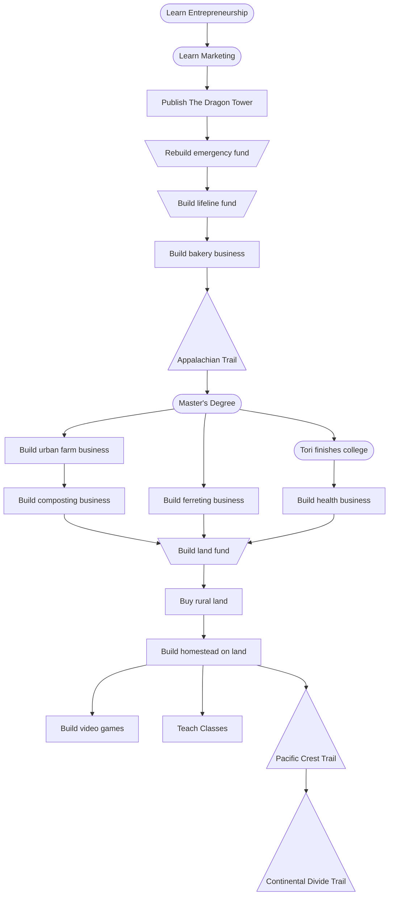

```mermaid
flowchart TD
    entrepreneur([Learn Entrepreneurship])
    -->marketing([Learn Marketing])
    -->game1[Publish The Dragon Tower]
    -->emergency[\Rebuild emergency fund/]
    -->businesssavings[\Build lifeline fund/]
    -->bakery[Build bakery business]
    -->thruhike1@{ shape: tri, label: "Appalachian Trail" }
    -->md([Master's Degree])
    -->urbanfarm[Build urban farm business]
    -->compost[Build composting business]
    -->housesavings[\Build land fund/]

    md
    -->ferreting[Build ferreting business]
    -->housesavings

    md
    -->tori([Tori finishes college])
    -->health[Build health business]
    -->housesavings
    
    -->countryside[Buy rural land]
    -->ruralhome[Build homestead on land]
    -->games[Build video games]

    ruralhome
    -->teach[Teach Classes]

    ruralhome
    -->thruhike2@{ shape: tri, label: "Pacific Crest Trail" }
    -->thruhike3@{ shape: tri, label: "Continental Divide Trail" }
```
